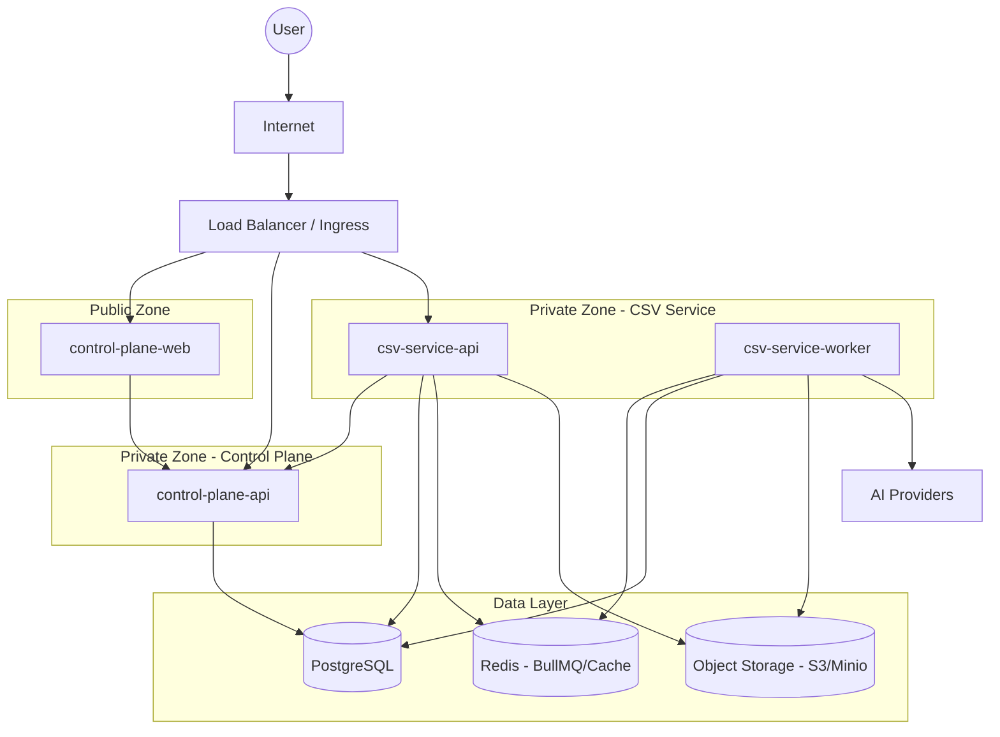

# Deployment Architecture

## Architecture Diagram

## Production Topology

- **VPC / Subnets**: 
  - Public Subnets: Load Balancer, NAT Gateway.
  - Private Subnets: API Services, Background Workers.
  - Isolated Subnets: Databases (RDS), Cache (ElastiCache).
- **Compute**: AWS ECS (Fargate) or Kubernetes (EKS).
- **Storage**: AWS S3 for CSV files and enriched results.
- **Database**: Managed PostgreSQL (RDS) with Multi-AZ for high availability.
- **Cache**: Managed Redis (ElastiCache) for BullMQ and session/cache.

## Secrets Management

1. **At Rest**: AI provider keys and internal secrets are stored in AWS Secrets Manager or HashiCorp Vault.
2. **In Transit**: Injected as environment variables at runtime via entrypoint script or native platform integration (ECS/K8s).
3. **Policy**:
   - No secrets in `Dockerfile`.
   - No secrets in `.env` files committed to Git.
   - Credentials for DB/Redis are rotating where possible.
   - AI keys are encrypted in the database before storage (application-level encryption).

## CI/CD Outline (GitHub Actions)

1. **Build & Test**:
   - Every PR triggers unit/integration tests and linting.
   - Docker image build for each service.
2. **Push**:
   - Images tagged with commit hash and `latest`.
   - Pushed to AWS ECR.
3. **Deploy (Staging)**:
   - Automated deploy to staging environment on merge to `main`.
4. **Deploy (Production)**:
   - Manual approval / Tag release.
   - Deploy to production cluster.

## Migration Strategy

- **Tool**: Drizzle-kit.
- **Process**: 
  - Migrations are bundled with `control-plane-api` image.
  - Before rolling out new API version, a one-off task (init container) runs `pnpm drizzle-kit push` or `migrate`.
  - Migrations MUST be backward-compatible (ADR requirement).

## Zero Downtime Strategy

1. **API Services**: Rolling update strategy. New containers are started and health-checked before old ones are terminated.
2. **Background Workers**: 
   - Graceful shutdown: `csv-service-worker` listens to `SIGTERM`, finishes current item, and stops polling.
   - Parallel execution: Multiple versions of workers can run simultaneously as they pull from the same Redis queue.
3. **Database**: Managed Multi-AZ failover handles most downtime; schema changes follow "Expand-Contract" pattern.
